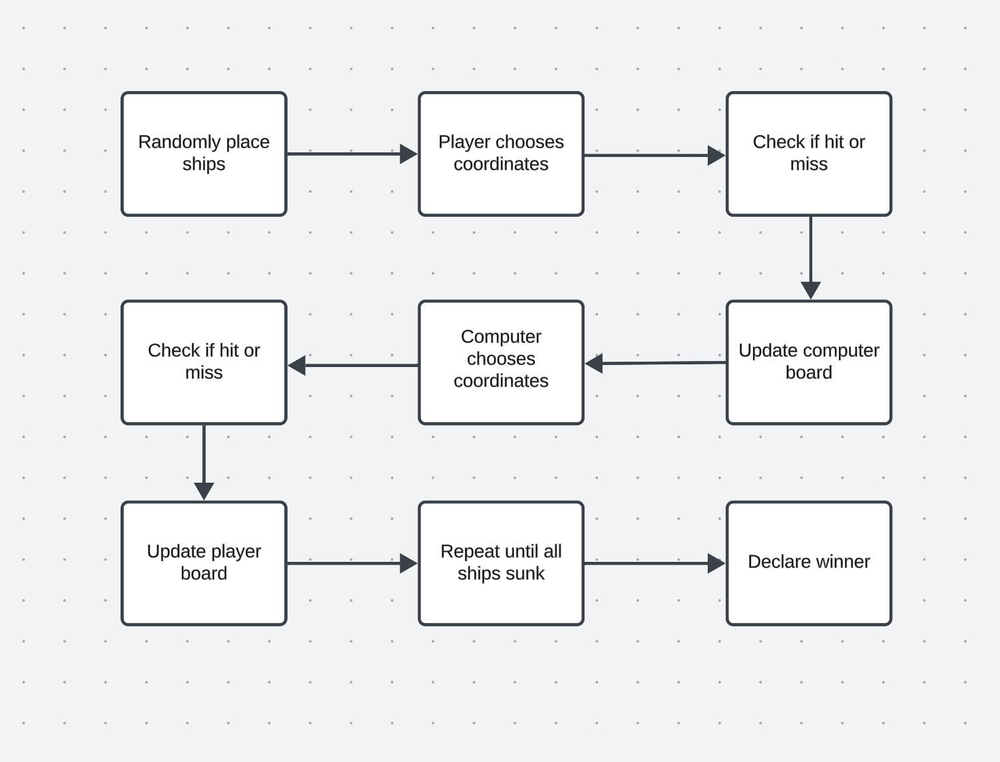

# Battleships

## Overview

Welcome to **Battleships**, a terminal-based classic naval strategy game. You command a hidden fleet on a customizable grid and take turns with a simple AI opponent to call shots, track hits and misses, and sink all enemy ships before they destroy yours.

## Features

- **Adjustable grid size**: Default is 5×5, but you can configure it in the code.
- **Input validation**:
  - Detects off-grid coordinates
  - Prevents repeated shots
  - Provides friendly error messages and re-prompts
- **Rich feedback**:
  - Hits (`X`) displayed in red
  - Misses (`·`) displayed in blue
  - Notifications when individual ships are sunk
- **Simple AI opponent**: Computer fires at random unseen cells

## Technologies Used

- **Python 3.x** – language and runtime  
- **Colorama** – for colored terminal output  
- **GitHub Actions** – continuous integration and CLI validation  

## Installation

1. **Clone the repository**  
   ```bash
   git clone https://github.com/GabeColetta24/Battleships.git
2. **Navigate to the project folder**: 
    ```bash
    cd Battleships
3. **Create and activate a virtual environment**: 
    ```bash
    python3 -m venv venv
    source venv/bin/activate
4. **Install dependancies**: 
    ```bash
    pip install -r requirements.txt
5. **Run the game**: 
    ```bash
    python battleships.py

## How to Use

Once installed and your virtual environment is active:

1. **Start the game**:
    ```bash
    python battleships.py
2. **Understand the prompt**: the game displays your own board (ships revealed), then shows an enemy board before your shot.
3. **Enter your shot**: input two coordinates (row and column) each from 0 to 4, separated by a space (e.g. 1 3), where the first number is the row and the second is the column.
4. **View the result**: the CLI will indicate a hit, miss, or ship sunk, with appropriate color-coded markers.
5. **Computer's turn**: the AI will then take a shot and display your updated board.
6. Repeat until all ships on one side are sunk.
7. **Quit early**: press Ctrl+C to exit the game at any time.

## Planning

I mapped out the game using a flowchart before coding



This flowchart provided a clear blueprint for implementation, ensuring that each step (ship placement, input validation, hit/miss handling, and win detection) was developed in a logical order. 

## Manual Testing

- **Off-grid input**  
  Enter `9 9` → ⚠️ Displays “Off-grid or already shot” error and re-prompts.

- **Repeat shot**  
  Enter the same coordinates twice (e.g. `1 1` then `1 1`) → ⚠️ Displays “already shot” error and re-prompts.

- **Hit**  
  Shoot a cell containing a ship → ✅ Displays “Hit!” and marks the cell in red.

- **Miss**  
  Shoot an empty cell → ❌ Displays “Miss.” and marks the cell in blue.

- **Sunk**  
  Hit the final segment of a ship → 💥 Displays “You just sank an enemy ship of length X!”

- **Win condition**  
  Sink all enemy ships → 🎉 Displays “You sank all the enemy ships! You win!”

- **Loss condition**  
  Have all your ships sunk → 💀 Displays “All your ships have been sunk. Game over.”

### Code Style & Linting

- The codebase is formatted with [Black](https://github.com/psf/black) (line length 88) and passes `flake8 battleships.py tests/` with zero errors, ensuring PEP8 compliance.

### Bugs Found & Fixed

- **Test unpacking error**  
  In `tests/test_board.py`, unpacking a list of tuples with `(r, c), = b.ships` raised a `ValueError`. Updated to `r, c = b.ships[0][0]` to correctly index the single-coordinate ship.

- **CI hang**  
  The initial smoke-test invoked the interactive loop. Resolved by moving to a standalone pytest suite in CI.

- **Long line in error message**  
  A runtime print statement exceeded PEP8’s line-length limit. Wrapped the string literal across two lines inside a `print(...)` call.

- **Imports in `conftest.py`**  
  Consolidated the `sys.path` hack into `tests/conftest.py` and ensured each import is on its own line to satisfy flake8’s E402/E401 rules.


## Future Enhancements

- **Dynamic grid sizing at runtime**: Prompt the player to choose grid dimensions before starting the game.
- **Advanced AI opponent**: Implement a hunt/target algorithm for smarter computer moves.
- **Manual ship placement**: Allow players to position their ships manually with coordinate input.
- **Multiplayer mode**: Add local or networked two-player functionality.
- **Replay & statistics**: Track and display win/loss records and session stats.

## Deployment & CI

### How to Deploy (GitHub Pages)

1. In your GitHub repo, go to **Settings** → **Pages**.  
2. Under **Source**, select **Branch: main** and **Folder: /(root)**.  
3. Click **Save**.  
4. After a minute, the banner will show your site URL (e.g. `https://GabeColetta24.github.io/Battleships/`).  

- **Live demo**: https://GabeColetta24.github.io/Battleships/  
- **CI workflow**:  
  

> **Note:** This is a CLI application. GitHub Pages hosts the README, and GitHub Actions runs the CLI tests on each push.

## Acknowledgements

- [Colorama](https://pypi.org/project/colorama/) – for easy terminal coloring  
- [Black](https://github.com/psf/black) – for auto-formatting Python code  
- [flake8](https://flake8.pycqa.org/) – for linting and style checks  
- StackOverflow and the Python docs for various implementation tips
